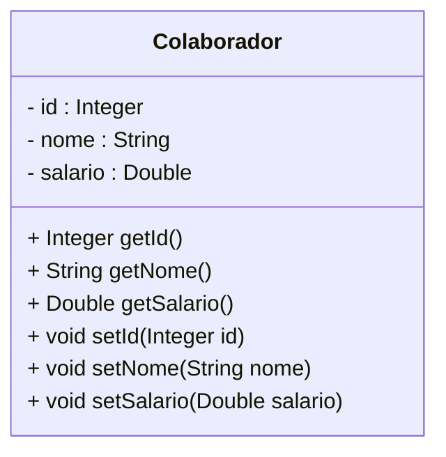

# Spring RH - Redis Database

<br />

<div align="center">
     
    <br /><b>com</b><br />
     
</div>


<br />

## Diagrama de Classes



<br />

## Instalação do Redis Database no Windows

1. Instalar ou habilitar o **WSL2**
2. Instalar o **Ubuntu** dentro do WSL2
3. Instalar o **Redis**:

```bash
curl -fsSL https://packages.redis.io/gpg | sudo gpg --dearmor -o /usr/share/keyrings/redis-archive-keyring.gpg

echo "deb [signed-by=/usr/share/keyrings/redis-archive-keyring.gpg] https://packages.redis.io/deb $(lsb_release -cs) main" | sudo tee /etc/apt/sources.list.d/redis.list

sudo apt-get update
sudo apt-get install redis
```

4. Iniciar o **Redis**:

```bash
sudo service redis-server start
```

5. Conectar com o **Redis**:

```bash
redis-cli 
127.0.0.1:6379> ping
PONG
```

6. Instalar a IDE **RedisInsight**: https://github.com/RedisInsight/RedisInsight

<div align="center"></div>

<br />

## Dependências do Spring


- [x] Spring WEB
- [x] Spring Boot Dev Tools
- [x] Spring Data Redis
